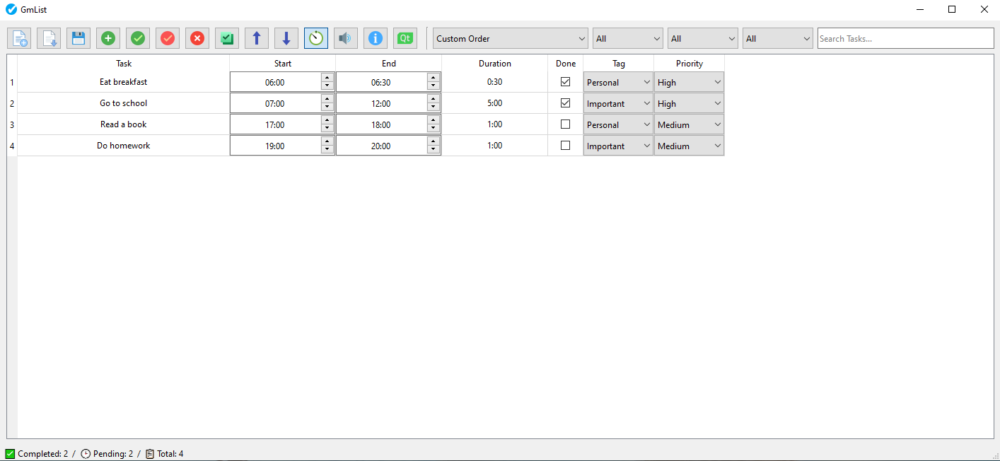

## GmList.Task.Manager 📝
A simple and efficient task manager built with Python and PyQt. Manage your tasks easily with a clean GUI, full editing, and advanced filtering options.

## Features
- Easy-to-Use GUI – Intuitive interface for managing tasks.
- Add, Edit, and Delete Tasks – Quickly manage your task list.
- Manual Save & Load – Users can save tasks to JSON files and load them manually.
- Priority Management – Assign priorities to tasks for better organization.
- Filtering & Search – Filter tasks by status (completed / not completed) or priority, and search tasks easily.
- Mark as Completed – Check tasks as done or pending.
- Tagging – Assign custom tags to tasks for better categorization.
- Sorting – Sort tasks alphabetically (A → Z or Z → A), by date (newest → oldest or oldest → newest), by duration (shortest → longest or longest → shortest), or by custom criteria.

## Screenshots

## Installation
- 1. Download the latest Release from the Releases section.
- 2. Extract the ZIP file.
- 3. Run the executable (GmList.Task.Manager.exe) for Windows.
> ⚠️ Currently Windows only. Linux/macOS versions are not provided.

## Usage
- Add new tasks using the GUI.
- Edit or delete existing tasks as needed.
- Assign priorities and tags for better organization.
- Filter tasks by completion status or priority.
- Search tasks with the built-in search box.
- Save and load tasks manually using the provided buttons to store or retrieve JSON files.

## Technologies

## License
GmList © 2026 by Gm is licensed under CC BY-SA 4.0

## Notes 💡
- All icons and assets are included in the main folder for easy loading.
- Paths in the code are case-sensitive; ensure folder names match.
- Designed for productivity and simplicity.
